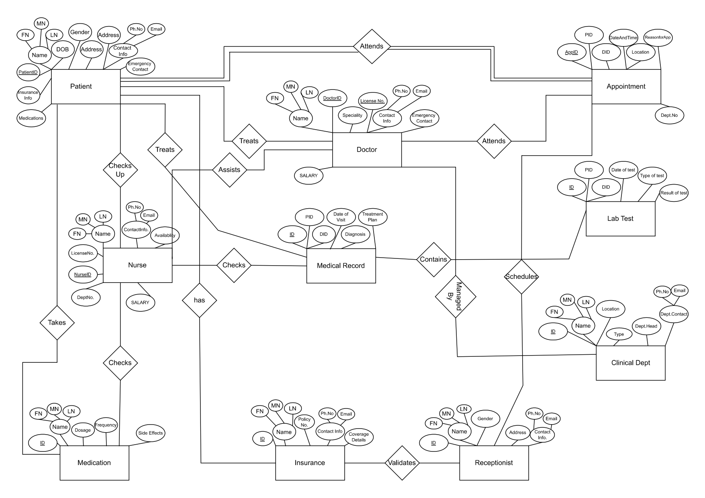

# 🏥 Health Center Database Management System


*Visual representation of the database structure*

## 📌 Overview

A comprehensive **Oracle SQL database system** designed to streamline operations for modern healthcare facilities. This system manages patient records, appointments, medical staff, lab tests, medications, and insurance processing through a normalized relational database model.

## ✨ Key Features

| Feature Category | Description |
|-----------------|-------------|
| **Patient Management** | Complete demographic tracking, insurance verification, and medication history |
| **Appointment System** | Doctor scheduling with receptionist oversight and status tracking |
| **Medical Records** | Secure EHR storage with diagnosis and treatment plan documentation |
| **Lab Integration** | Test ordering, result tracking, and department association |
| **Staff Management** | Doctor specialties, nurse assignments, and receptionist functions |
| **Reporting** | Built-in queries for common healthcare analytics |

## 🛠️ Technical Implementation

```mermaid
graph TD
    A[Patient Data] --> B[Appointments]
    A --> C[Medical Records]
    B --> D[Doctors]
    B --> E[Receptionists]
    C --> F[Lab Tests]
    D --> G[Clinical Departments]
