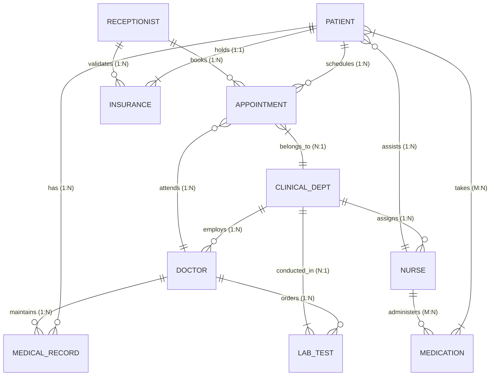

# Health Center Database - ER Diagram Documentation

## 📐 Entity-Relationship Diagram

```mermaid
erDiagram
    PATIENT ||--o{ APPOINTMENT : "schedules (1:N)"
    PATIENT ||--o{ MEDICAL_RECORD : "has (1:N)"
    PATIENT ||--|{ INSURANCE : "holds (1:1)"
    PATIENT }|--|{ MEDICATION : "takes (M:N)"

    DOCTOR ||--o{ APPOINTMENT : "attends (1:N)"
    DOCTOR ||--o{ MEDICAL_RECORD : "maintains (1:N)"
    DOCTOR ||--o{ LAB_TEST : "orders (1:N)"

    NURSE ||--o{ PATIENT : "assists (1:N)"
    NURSE ||--o{ MEDICATION : "administers (M:N)"

    RECEPTIONIST ||--o{ APPOINTMENT : "books (1:N)"
    RECEPTIONIST ||--o{ INSURANCE : "validates (1:N)"

    CLINICAL_DEPT ||--o{ DOCTOR : "employs (1:N)"
    CLINICAL_DEPT ||--o{ NURSE : "assigns (1:N)"

    APPOINTMENT }|--|| CLINICAL_DEPT : "belongs_to (N:1)"
    LAB_TEST }|--|| CLINICAL_DEPT : "conducted_in (N:1)"
```
